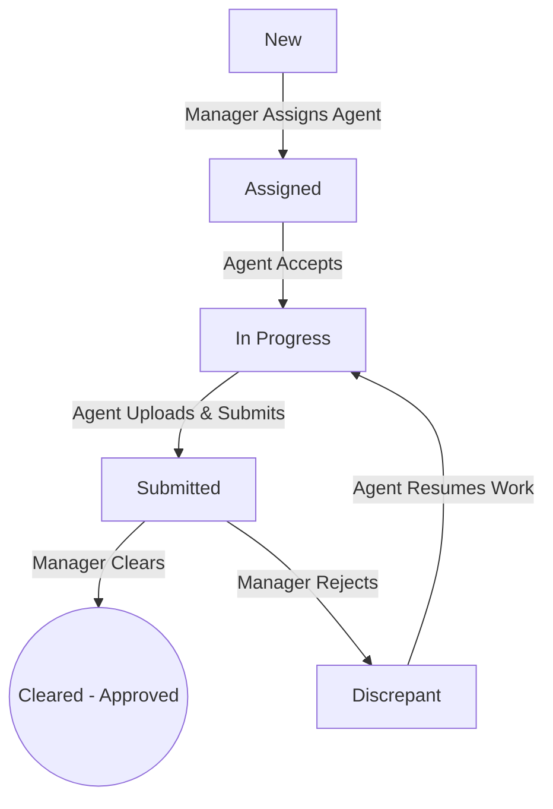

# Mini Case Tracker — Operations Workflow Portal (MERN Stack)

A lightweight workflow compliance platform that replaces spreadsheet operations for a operations team. Enforces role-based permissions, status transitions, uploads supporting documents, and logs audit events.

---

## Tech Stack
* **Frontend**: React (Vite) + Ant Design (Theme customized with Slate & Indigo glassmorphism) + Axios
* **Backend**: Node.js + Express.js + Mongoose (MongoDB) + Multer (File uploads) + JWT Auth
* **Security & Compliance**: Passwords encrypted via bcryptjs, JWT route protection, and server-side state machine verification.

---

## Folder Structure
```text
case-tracker/
├── backend/
│   ├── config/            # DB connection
│   ├── controllers/       # Auth, Case, Comment, and Doc controllers
│   ├── middleware/        # JWT & role authorization check
│   ├── models/            # User, Case, Document, Comment, AuditLog models
│   ├── routes/            # Express routers
│   ├── scripts/           # DB Seeding script
│   ├── uploads/           # Local file storage location (gitignored)
│   ├── .env               # Server configurations
│   ├── package.json
│   └── server.js          # App entrypoint
└── frontend/
    ├── src/
    │   ├── pages/         # Login, Register, Dashboard, CaseDetail views
    │   ├── App.jsx        # Routing context, global dark theme
    │   ├── index.css      # Core styles & gradients
    │   └── main.jsx
    ├── package.json
    └── vite.config.js
```

---

## Run & Install Locally (Under 5 Minutes)

### Prerequisites
* **Node.js** (v18 or higher recommended)
* **MongoDB** (A local running instance on `mongodb://localhost:27017` or a MongoDB Atlas URI)

### Step 1: Clone and Install Dependencies

Open a terminal and install dependencies for the backend and frontend:

**Backend Setup:**
```bash
cd backend
npm install
```

**Frontend Setup:**
```bash
cd ../frontend
npm install
```

### Step 2: Configure Environment Variables

Create a `.env` file in the `backend/` directory (a pre-configured one has already been created during initial installation):
```env
PORT=5000
MONGO_URI=mongodb://127.0.0.1:27017/case-tracker
JWT_SECRET=case_tracker_jwt_secret_key_2026
```
*(If you are using MongoDB Atlas, replace `MONGO_URI` with your connection string).*

### Step 3: Seed the Database

Seed the database with sample cases, users, comments, and audit trails:
```bash
cd ../backend
node scripts/seed.js
```

### Step 4: Run the Application

**Start the Backend Server (from `backend/` folder):**
```bash
npm run dev
# Or direct command: node server.js
```
*(Runs on `http://localhost:5000`)*

**Start the Frontend App (from `frontend/` folder):**
```bash
cd ../frontend
npm run dev
```
*(Runs on `http://localhost:5173`)*

Open your browser and navigate to **`http://localhost:5173`**.

---

## Demo Accounts

Use these pre-seeded accounts to explore the manager and agent roles:

| Username | Password | Role | Description |
| :--- | :--- | :--- | :--- |
| **`manager`** | `password123` | **Manager** | Creates cases, assigns them, approves (Clears), or rejects (marks Discrepant). |
| **`agent1`** | `password123` | **Agent** | View assigned cases, accept/start work, upload documents, and submit for review. |
| **`agent2`** | `password123` | **Agent** | Pre-seeded with a case that is already in "Submitted" status for Manager approval. |

---

## Enforced Server-Side Workflow Transitions

Every status write verifies that the requested transition is permitted according to the state machine:



* **Manager Controls**: Create Cases, Assign Agents, Clear Cases, Mark Discrepant.
* **Agent Controls**: Accept Case (change to *In Progress*), Upload Documents/Add Notes, Submit Case.
* **Audit Trail**: Every transaction is logged into the `AuditLog` database table, detailing who performed the change, previous/new status, timestamps, and feedback/completion notes.
